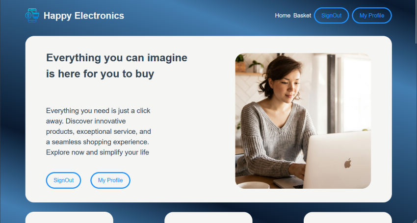

# Happy Electronics e-Commerce 

  
  
  
  
  
   
  

## Features

This is an e-commerce website that is selling electronic products. In this site, users can create an account with email and password, they can login-signin. If customers logged in properly, they can reach their basketPages or userProfilePages. Users  can search in all products for thing which they want spesific product (paying attention to case-sensitivity) or they can learn more info by clicking the product "more" button. You can see your registration date and nickname, add the product to your basket. It's a symbolic e-commerce website to do practice. So of course you cannot buy really a product or pass to payment page naturally. But you can try most of things that a customer do in a regular online shop.

## Technologies - Libraries - Frameworks
The website's basic design was prepared by ordinary languages, `HTML5`, `CSS3` but while css codes were writing, `Scss - Sass` pre-processor were used and compiled with a VS Code extension automatically. In this `React.js` project, `react-router-dom` provided smooth page navigation. `Firebase SDK`' s auth-part was used for Authentication and authorization process in website. Project is saving unnecessary datas like basket items, to browser local storage by some static class functions. But it is keeping user datas and example product datas  in database by `Firebase / Firestore`. So, when a user wrote a word in the search-bar, project send a qouery to database with firebase methods and async js functions. Most of variable (includings functions) was written via `TypeScript`'s type notation and context api structure transfered some significant objects like "auth" or "user" to other components.

## To Run Project
* Clone repository's branch with `git clone https://github.com/celik-arda/e-commerce.git main` command
* go and locate in main folder and install all necessary packages with `npm install`
* <i><b>For using npm : </b></i>run project with `npm run dev`
* <i><b>For using yarn : </b></i>run project with `yarn dev`
* <i><b>For using linux-ubuntu (WSL2) : </b></i> may select one of theese commands and use to run this vite-project from ubuntu terminal instead of integrated editor terminal
* If page doesn't open in your browser's default localhost address, <b>write dedicated link and port</b> that are same in vite-config file, server address was adjusted as `http://127.0.0.1:4444/`